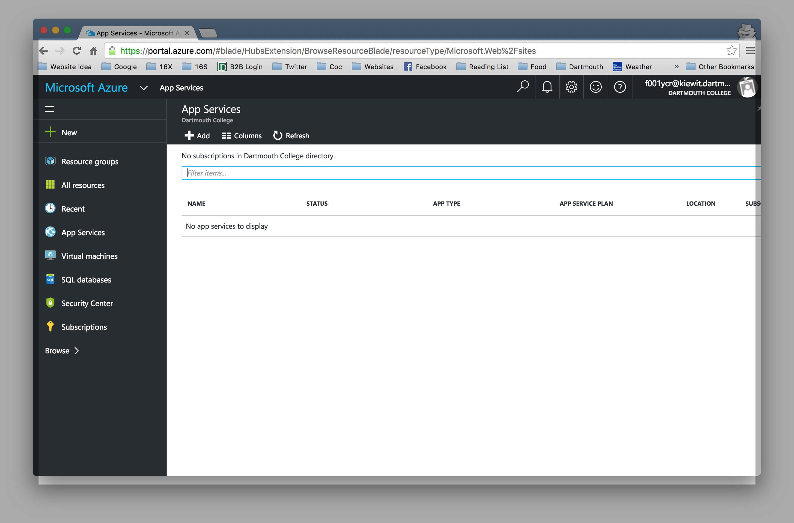
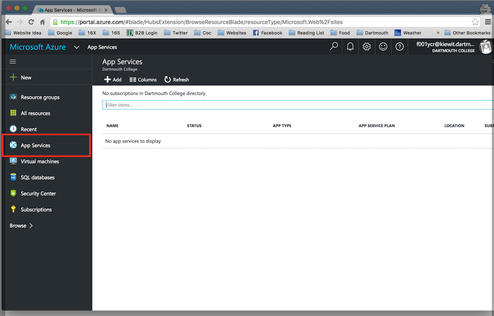
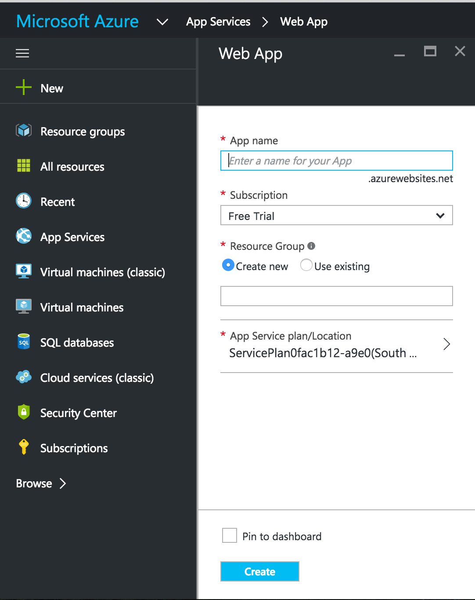

# Welcome to our Deployment Workshop!

We will be exploring some of AWS's products, specifically EC2, and Microsoft Azure's deployment capapbilites!!! Wow!

## Sign Up
In order to use AWS, we'll first need to make an account. Let's use a student discount!

:rocket: Go to [GitHub Develper Pack](https://education.github.com/pack) and then select the "Get Your Pack" button.

:rocket: Scroll down and click on the "unique link" next to the AWS logo. This should open up a new tab on your browser.

Select student for "Role." Fill out the information requested for the application. If you do not have an AWS account, select the link found under the 'AWS Account ID' input.

Select "I am a new user." Fill out the application.

:rotating_light: NOTE: You will be asked to input credit card information. The GitHub Developer Pack will cover all costs so nothing will be charged on your card.

Choose the “basic” support plan when prompted. After completing the AWS account application, you should receive a confirmation email.

Now to get our AWS account ID!

Go to the [AWS website](https://aws.amazon.com/) and sign in by clicking on the "Sign in to Console" button. Select the "Manage Account" section

Your ID will be listed under “Account Settings," copy it and input it in the 'AWS Account ID' in the student application we were working on!

After completing the student application, you should receive a confirmation email about your app being under review. You should receive receive an email from AWS within 24 hours about your application being approved.

Now you're ready!

# Microsoft Azure

## Hosting a Static Website

Modified from [Azure Website](https://azure.microsoft.com/en-us/documentation/articles/app-service-deploy-local-git/)

One of the most useful things about deployment services is that they allow you
to focus on just your code while the service takes care of the servers and other
aspects of a project that might be of concern.

For this part of the workshop we are going to take a program that you have already
written and use another deployment service to host the website.

To start you will need to make an Azure account. Luckily for us our Dartmouth
accounts give us access to Azure.

Go to [this link](https://login.microsoftonline.com/common/oauth2/authorize?resource=https%3a%2f%2fmanagement.core.windows.net%2f&response_mode=form_post&response_type=code+id_token&scope=user_impersonation+openid&state=OpenIdConnect.AuthenticationProperties%3dZgWkl5BALa-ym9GOVOmNzmvJU-hJ0YEKSXqcLoYQIwkut27AFt7nYesVttjWgP_Uax41Gd6ga3FjCPF0mIKoBS4vH5p9vZOO8zL8tBEjkE2e_OqgdTbQOFX4K8tI8S0Z-h-ZU2YaFOtO-VdAYhW2izvpvLs6VO9aIQcj8Ef5TNv753vF&nonce=636058836739134229.OTAxZjE2ODEtNGM0OS00Y2FiLWE3YTctMjE1NGRiM2ZhMmYxZmZlNDRjOGEtY2Q2My00ZGVjLTg4YmItMGYwMzQ2OWM2Yjhl&client_id=c44b4083-3bb0-49c1-b47d-974e53cbdf3c&redirect_uri=https%3a%2f%2fportal.azure.com%2fsignin%2findex%2f%3fsignIn%3d1%26cdnIndex%3d4&site_id=501430)

- Use the dartmouth email FXX####@kiewit.dartmouth.edu

- But use your NetID in place of "FXX####." Some wizadry happens and it should automatically redirect after you type in your email... 

- It should take you to the dartmouth sign in page, sign in.

You should now be on the Azure dashboard.

Now click on App Services->Add

**Now you have to sign up for Azure services. If you select the free trial it will ask you for credit card information but you will not be charged at all**

Once you sign-up, return to the dashboard.

Click new again. Select a name for you app, and a name for a new resource group.

It will take a minute for your new app to show up in the App Services section, when it does, click on it.

Click settings and scroll down to publishing->Deployment Source.

Select Github as the configuration source. If it asks for your permission to connect to your Github account. Select yes.

As the project, select the landing page that you created in Lab 1 and whatever your most updated branch is, for most of you it should be gh-pages.

Then click Ok.

It should take another minute to deploy, then you can click browse and it should take you to your landing page. This shows just how easy it is to deploy your website without having to worry about the deployment process! 

Now that your git repository is connected to Azure, whenever you push to git it will automatically update your website. Try making a small change to your page to watch it update automatically.

### YAY SUCCESS!!!

# WordPress with AWS EC2

___
In this part, we will use one of Amazon Web Services' most popular products, an EC2 instance, which is basically a cloud server that runs in a region that they control. Think of it as the flume or wildcat server that we used in CS50. You can do a lot from these since they are machines that work much like your own computer. We are going to create a wordpress website that you can modify as your own using an EC2 instance of your own!
___

Modified from [this link](http://coenraets.org/blog/2012/01/setting-up-wordpress-on-amazon-ec2-in-5-minutes/)

### Step 1

Create an AWS account... you should've already done this. :eggplant:

### Step 2

* Head over to your AWS console. Already lost? :neutral_face: Your console is hosted http://console.aws.amazon.com/console/home.

* Under the "AWS Services" header, then under the sub-header "Compute", click "EC2".

* Time to create an instance! What a time to be alive. Click the blue "Launch Instance" button under "Create Instance".

* STEPS FOR CREATING AN INSTANCE (8 quick steps, progress display on top of webpage)

  1. Choose AMI - Choose the Amazon Linux AMI. Should be at the top. :top: :up: :cool:

  2. Choose Instance Type - General purpose t2.micro should already be selected. That will work fine. Click Next on the bottom right.

  3. Instance Config - Nothing to do. Click Next (bottom right).

  4. Add Storage - Nothing. Click Next.

  5. Tag Instance - Nothing. Click Next.

  6. Security Config - Nothing. Click Next.

  7. Review - Nothing. Click Launch.

  8. Key Pair - a pop-up should appear to select a key pair. Click the "Choose an existing key pair" bar then click "Create a new key pair" from the drop-down menu. Type in your name as the key pair name, in the format of yourLastName_yourFirstInitial. Click the "Download Key Pair" button.
      - An absurd looking text file should be download (and possibly opened). :warning: MOVE THAT FILE TO YOUR DESKTOP.
      - Click the "Launch Instances" button to launch your new instance! :relaxed: :blush: :smile: :gun:

### Step 3

* From the terminal, head over to your DESKTOP.

  `cd ~/Desktop`

* Run the command:

  `ls`

* This will display the names of all the files currently on your Desktop.

  * You should see a .pem file with your name in the title formatted like yourLastName_yourFirstInitial. This is the absurd looking file saved from before.

  * run the following chmod command to change permissions of this file to private:

    `chmod 400 filename`

    * with 'filename' being the name of the .pem file.

* It's time to SSH into your instance. You'll do this by running this command from the terminal

  `ssh ec2-user@your_public_dns -i key_file`

  * 'your_public_dns' is the "Public DNS" for your instance. To get this do the following:

    * Quickly head over to your AWS EC2 console (https://console.aws.amazon.com/ec2/).

    * On the nav bar to left, under "INSTANCES", click "Instances". You should see your t2.micro instance in the table.

    * Somewhere near the center of the screen (towards the bottom), you should see your instance's "Public DNS" displayed in bold. Use this for 'your_public_dns' in the ssh command above.

  * 'key_file' is the .pem file from above that your ran the chmod command on.

* So... once you have everything... ssh with:

  `ssh ec2-user@your_public_dns -i key_file`

* The following will most likely be displayed.

  `Are you sure you want to continue connecting (yes/no)?`

  * If displayed, type 'yes' then click enter. You should see this:

`
       __|  __|_  )
       _|  (     /   Amazon Linux AMI
      ___|\___|___|
`

* You're logged into your new instance now! Let's gooo!

### Step 4
Run these commands to run an apache web server on your instance.

  * `sudo su`
    * changes permissions.

  * `yum install httpd; service httpd start`
    * follow prompts, agree to everything.

### Step 5
Run these commands to install php (massive):

* `yum install php php-mysql; service httpd restart`
  * follow prompts, agree to everything.

### Step 6
Run these commands to install and run SQL (colossal):
  * `yum install mysql-server; service mysqld start`
    * follow prompts, agree to everything.

Additionally, run this commands to create and initialize a blog database through SQL:
  * `mysqladmin -uroot create wordpress; mysql_secure_installation; while [ 1 ]; do echo 'RIP Harambe'; done`
    * You will be prompted a few times in order to secure your database. Do the following:

      * when "Enter current password for root (enter for none)" appears press enter.

      * when "Set Root Password" appears enter 'Y', then you will set a password.

      * make note of the password that you set (make it simple, 2 characters is best)

      * enter YES ('Y') for everything else.

      * press control+c to kill loop if you hate Harambe

### Step 7
Install word press:

* `cd /var/www/html; wget http://wordpress.org/latest.tar.gz; tar -xzvf latest.tar.gz; cd wordpress`

Move your config file:

* `mv wp-config-sample.php wp-config.php`

Time to edit your config settings. Enter a text editor using:

  * `vi wp-config.php`

  * This is a vim editor. Press "i" to enter editing mode. Scroll down to find and update the following config settings

    - `define(‘DB_NAME’, ‘wordpress’);`
    - `define(‘DB_USER’, ‘root’);`
    - `define(‘DB_PASSWORD’, ‘password you set’);`
      - password you just set when securing your SQL
    - `define(‘DB_HOST’, ‘localhost’);`

  * When you are done type the following in order...
    * press the `ESC` key
    * press the `SHIFT+colon` key pairing
    * type `wq`
    * press the `ENTER` key

### Step 8
Setting up WordPress.
___
### Last step :pray::pray::pray:
___

* For the last time, head to your AWS console... :neutral_face: :neutral_face: :neutral_face: http://console.aws.amazon.com/console/home.

* On the nav bar to left, under "INSTANCES", click "Instances". You should see your t2.micro instance in the table.

* Hover your cursor over the row in table that contains your instance. Scroll all the way to the right until the "Security Groups" column appears.

* click the link under "Security Groups"
  * probably will read `launch-wizard-2`

* Somewhere near the center of the screen (towards the bottom) should read your security group. Mine reads:

  `Security Group: sg-91a482f7`

* Under that label, click the `Inbound` tab. This is used to select inbound traffic security settings to your instance.

* Make it public! Find and press the `Edit` button (should still be under the `Inbound` tab).

* A pop-up should appear titled `Edit inbound rules`.

  * Under `Type`, select the drop-down menu and click `HTTP`.

  * Press the `Save` button.

  * YOU'RE DONE!!!

___

## Visit your webpage

* Go to your "Public DNS" link. To get this do the following:

  * Head over to your AWS EC2 console (https://console.aws.amazon.com/ec2/).

  * On the nav bar to left, under "INSTANCES", click "Instances". You should see your t2.micro instance in the table.

  * Somewhere near the center of the screen (towards the bottom), you should see your instance's "Public DNS" displayed in bold.

  * ### visit your_public_dns/wordpress

    * Login with your credentials and have fun with your new blog!

    * You have now deployed a WordPress blog using Amazing AWS EC2. Congrats. :cold_sweat:

# What Did We Do?
	
	Hello 
