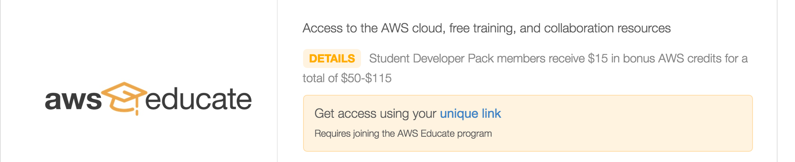
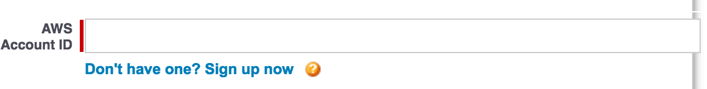
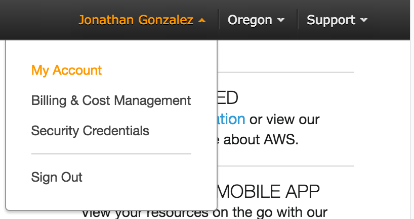

# Welcome to our Deployment Workshop!

We will be exploring some of AWS's products, specifically EC2 and S3. Wow!

## Sign Up
In order to use AWS, we'll first need to make an account. Let's use a student discount!

:rocket: Go to [GitHub Develper Pack](https://education.github.com/pack) and then select the "Get Your Pack" button.

:rocket: Scroll down and click on the "unique link" next to the AWS logo. This should open up a new tab on your browser.

Select student for "Role." Fill out the information requested for the application. If you do not have an AWS account, select the link found under the 'AWS Account ID' input.

Select "I am a new user." Fill out the application.

:rotating_light: NOTE: You will be asked to input credit card information. The GitHub Developer Pack will cover all costs so nothing will be charged on your card.

Choose the “basic” support plan when prompted. After completing the AWS account application, you should receive a confirmation email.

Now to get our AWS account ID!

Go to the [AWS website](https://aws.amazon.com/) and sign in by clicking on the "Sign in to Console" button. Select the "Manage Account" section

Your ID will be listed under “Account Settings," copy it and input it in the 'AWS Account ID' in the student application we were working on!

After completing the student application, you should receive a confirmation email about your app being under review. You should receive receive an email from AWS within 24 hours about your application being approved.

Now you're ready!

# Microsoft Azure

### Hosting a Static Website

Modified from [Azure Website](https://azure.microsoft.com/en-us/documentation/articles/app-service-deploy-local-git/)

One of the most useful things about deployment services is that they allow you
to focus on just your code while the service takes care of the servers and other
aspects of a project that might be of concern.

For this part of the workshop we are going to take a program that you have already
written and use another deployment service to host the website.

To start you will need to make an Azure account. Luckily for us our Dartmouth
accounts give us access to Azure.

Go to [this link](https://login.microsoftonline.com/common/oauth2/authorize?resource=https%3a%2f%2fmanagement.core.windows.net%2f&response_mode=form_post&response_type=code+id_token&scope=user_impersonation+openid&state=OpenIdConnect.AuthenticationProperties%3dZgWkl5BALa-ym9GOVOmNzmvJU-hJ0YEKSXqcLoYQIwkut27AFt7nYesVttjWgP_Uax41Gd6ga3FjCPF0mIKoBS4vH5p9vZOO8zL8tBEjkE2e_OqgdTbQOFX4K8tI8S0Z-h-ZU2YaFOtO-VdAYhW2izvpvLs6VO9aIQcj8Ef5TNv753vF&nonce=636058836739134229.OTAxZjE2ODEtNGM0OS00Y2FiLWE3YTctMjE1NGRiM2ZhMmYxZmZlNDRjOGEtY2Q2My00ZGVjLTg4YmItMGYwMzQ2OWM2Yjhl&client_id=c44b4083-3bb0-49c1-b47d-974e53cbdf3c&redirect_uri=https%3a%2f%2fportal.azure.com%2fsignin%2findex%2f%3fsignIn%3d1%26cdnIndex%3d4&site_id=501430)
- Use the dartmouth email FXX####@kiewit.dartmouth.edu
- But use your NetID.
- It should take you to the dartmouth sign in page, sign in.

You should now be on the Azure dashboard.

Now click on App Services->Add

**Now you have to sign up for Azure services. If you select the free trial it will ask you for credit card information but you will not be charged at all**

Once you sign-up, return to the dashboard.

Click new again. Select a name for you app, and a name for a new resource group.

It will take a minute for your new app to show up in the App Services section, when it does, click on it.

Click settings and scroll down to publishing->Deployment Source.

Select Github as the configuration source. If it asks for your permission to connect to your Github account. Select yes.

As the project, select the landing page that you created in Lab 1 and whatever your most updated branch is, for most of you it should be gh-pages.

Then click Ok.

It should take another minute to deploy, then you can click browse and it should take you to your landing page.

# YAY SUCCESS!!!

